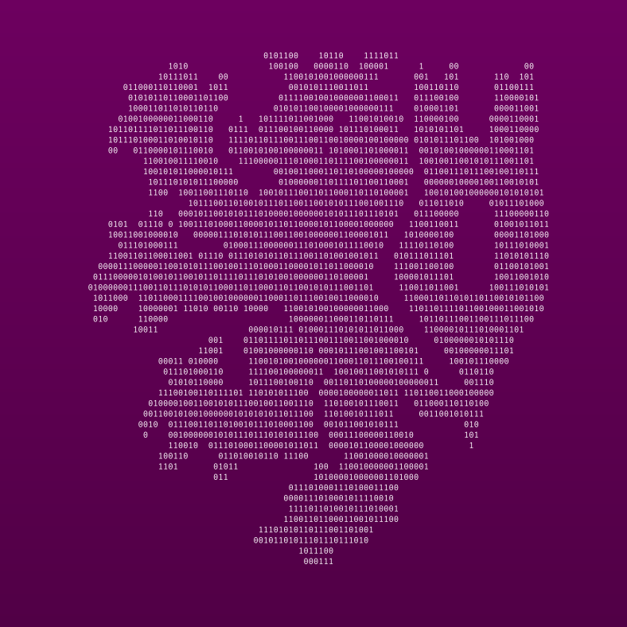

# ML-ILD: Machine learning based Information Leakage Detection
  

This package is able to automatically test detect Information Leakage in a system that generated binary classification datasets.
Installation
------------
The latest release version of CS-Rank can be installed from Github as follows::
	
	pip install git+https://github.com/prithagupta/ML-ILD.git

Another option is to clone the repository and install PY-SCA using::

	python setup.py install

Dependencies
------------
MI-ILD depends on NumPy, SciPy, matplotlib, scikit-learn, joblib and tqdm. For data processing and generation you will also need and pandas.

Citing CS-Rank
----------------
You can cite our `AISec` Paper_::

	@inproceedings{autosca,
		author = {Drees, Jan Peter and Gupta, Pritha and H\"{u}llermeier, Eyke and Jager, Tibor and Konze, Alexander and Priesterjahn, Claudia and Ramaswamy, Arunselvan and Somorovsky, Juraj},
		title = {Automated Detection of Side Channels in Cryptographic Protocols: DROWN the ROBOTs!},
		year = {2021},
		isbn = {9781450386579},
		publisher = {Association for Computing Machinery},
		address = {New York, NY, USA},
		url = {https://doi.org/10.1145/3474369.3486868},
		doi = {10.1145/3474369.3486868},
		booktitle = {Proceedings of the 14th ACM Workshop on Artificial Intelligence and Security},
		pages = {169–180},
		numpages = {12},
		keywords = {tls, bleichenbacher, side channel, machine learning},
		location = {Virtual Event, Republic of Korea},
		series = {AISec '21}
	}

License
--------
[Apache License, Version 2.0](https://github.com/kiudee/cs-ranking/blob/master/LICENSE)
